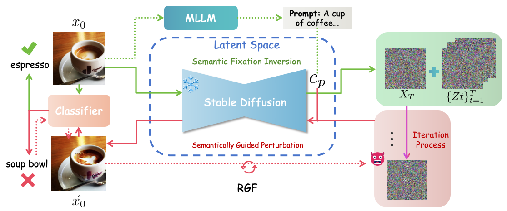

# SCA: Highly Efficient Semantic-Consistent Unrestricted Adversarial Attack
paper: 
## Abstract
Unrestricted adversarial attacks typically manipulate the semantic content of an image (e.g., color or texture) to create adversarial examples that are both effective and photorealistic. Recent works have utilized the Diffusion Inversion process to map images into a latent space, where high-level semantics are manipulated by introducing perturbations. However, they often results in substantial semantic distortions in the denoised output and suffers from low efficiency. In this study, we propose a novel framework called Semantic Consistent Unrestricted Adversarial Attacks (SCA), which employs an inversion method to extract edit-friendly noise maps and utilizes Multimodal Large Language Model (MLLM) to provide semantic guidance throughout the process. Under the condition of rich semantic information provided by MLLM, we perform the DDPM denoising process of each step using a series of edit-friendly noise maps, and leverage DPM Solver++ to accelerate this process, enabling efficient sampling with semantic consistency. Compared to existing methods, our framework enables the efficient generation of adversarial examples that exhibit minimal discernible semantic changes. Consequently, we for the first time introduce Semantic Consistent Adversarial Examples (SCAE). Extensive experiments and visualizations have demonstrated the high efficiency of SCA, particularly in being on average 12 times faster than the state-of-the-art attacks.

## Pipeline

You need to download the test image dataset and checkpoints of the target model yourself.
